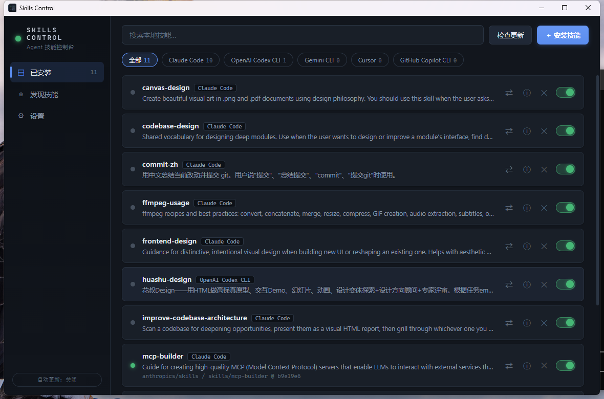

# Skills Control

> AI Agent 技能控制台 —— 从 GitHub 安装技能、自动更新、启用/禁用、跨 Agent 同步，一个面板管理所有。



现在 Claude Code、OpenAI Codex CLI、Gemini CLI 等主流 AI 编程工具都支持 [Agent Skills](https://github.com/anthropics/skills) 开放标准（`SKILL.md`），但技能散落在各个工具自己的目录里，装了什么、有没有更新、能不能给别的工具用，全靠手动管理。**Skills Control** 把这些收进一个桌面控制台。

## 功能

- **📦 从 GitHub 安装** — 粘贴 `user/repo` 或完整链接（支持子目录），自动扫描仓库里所有 `SKILL.md`，勾选安装；一次可同时装入多个 Agent
- **🔄 自动更新** — 记录每个技能的来源仓库与提交，一键检查/全部更新；默认开启定时自动更新（应用运行期间按设定间隔静默检查并更新，只在技能文件真的变化时才重装）
- **🗂 统一列表** — 自动检测本机已安装的主流 Agent（Claude Code / OpenAI Codex CLI / Gemini CLI / OpenCode / Cursor / GitHub Copilot CLI / Qwen Code），扫描它们各自目录里的全部技能，包括不是本工具安装的
- **⇄ 跨 Agent 同步** — 把任意已有技能一键复制到其他 Agent 的技能目录，立即可被调用
- **🔘 启用 / 禁用** — 拨动开关即可临时禁用技能（移入 `skills-disabled` 备份目录，随时恢复），不必删除
- **🔍 发现技能** — 站内搜索 GitHub 上的技能仓库，看星标和更新时间，直接安装
- **📁 自定义目录** — 任何包含技能子目录的文件夹都可以作为自定义 Agent 接入

## 下载安装

前往 [Releases](../../releases) 页面下载：

| 文件 | 说明 |
|---|---|
| `SkillsControl-Setup-x.x.x.exe` | Windows 安装版（推荐） |
| `SkillsControl-Portable-x.x.x.exe` | Windows 便携版，免安装直接运行 |

> 系统要求：Windows 10 及以上（解压依赖系统自带的 `tar`）。

## 使用说明

1. **安装技能**：点右上角「＋ 安装技能」，粘贴仓库地址（比如官方技能库 `anthropics/skills`），解析后勾选想要的技能和目标 Agent。
2. **检查更新**：「检查更新」会按来源仓库比对最新提交，有更新的技能行首会亮琥珀灯；定时自动更新默认开启，可在「设置」调整间隔或关闭。
3. **同步**：技能行的 ⇄ 按钮可以把技能复制给其他 Agent。
4. **Token（可选）**：安装和更新完全不走 GitHub API，没有任何次数限制、无需配置。只有「发现」页的搜索走 API（未登录约 10 次/分钟），搜索频繁时可在「设置」填入 [Personal Access Token](https://github.com/settings/tokens)。

安装记录保存在 `~/.skills-control.json`。为安全起见，本工具不会覆盖非它安装的同名技能。

## 从源码运行 / 构建

```bash
git clone https://github.com/zj9954/skills-control.git
cd skills-control
npm install
npm start        # 开发运行
npm run dist     # 打包（输出到 dist/）
```

## 技术说明

- Electron + 原生 Node.js，无前端框架、零运行时依赖
- 安装与更新**完全不依赖 GitHub API**：直接下载仓库 tarball 后本地扫描 `SKILL.md`；更新检查读取仓库 commits 的 Atom 订阅源比对提交，均不受 API 速率限制，也不需要本机安装 git
- 更新时按目录内容哈希比对，仓库其他文件的提交不会触发无意义的重装
- 主进程/渲染进程严格隔离（`contextIsolation` + preload 白名单 IPC）

## License

[MIT](LICENSE)
